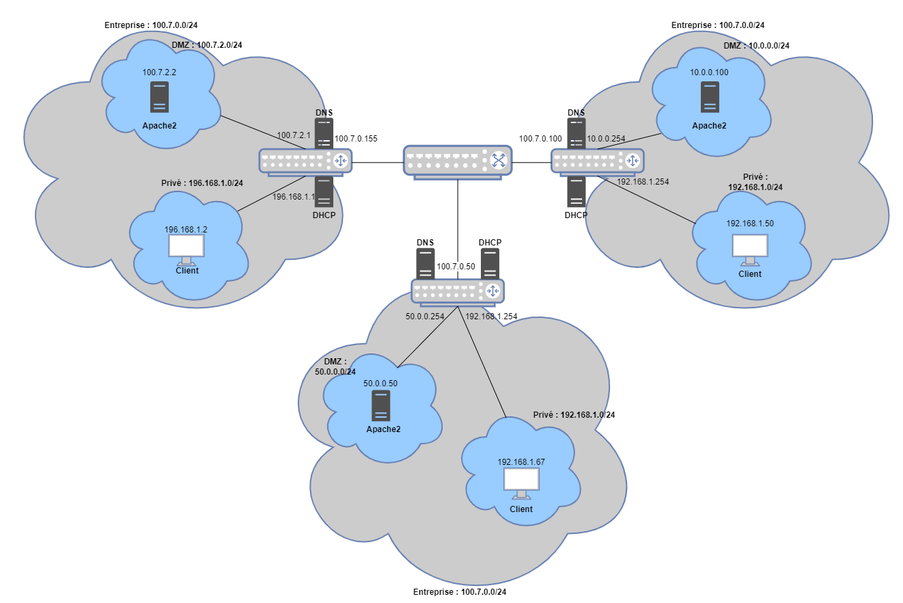

# Mise en place d'un réseau d'entreprise



**Requirements:**
- Debian

3 machines:
pub, priv, router
pub & priv have 2 interfaces
router have 3 intefaces : 
1 


machine | @IP | @IP_res

e-pub | 100.7.2.2 | 100.7.2.0/25

e-priv| 192.168.1.2 | 192.168.1.0/25

e-router| 192.168.1.1 & 100.7.2.1 | both

Un membre de notre équipe étant malade, certaines configurations ont été faites sans lui, et il se peut que dans certains fichiers de configuration il manque des routes vers son réseau en conséquence.

## Credentials :
eric:eric

root:root

---

## Partie 1 - Mise en place du réseau sur les VMs
### **Q1.1 Faut-il mettre en place du NAT pour la communication entre la DMZ et le réseau privé ? Pourquoi ?**
Il est utile de mettre en place le NAT afin de cacher les adresses IP du réseau privé. De la sorte il est plus difficile d'identifier les différentes machines du réseau privé. Cependant, il n'est pas nécessaire du mettre du NAT entre le réseau privé et la DMZ, car ceux-ci étant réliés au même routeur, il suffira de faire des régles de pare-feu.

### **Q1.2 Décrire l’enchainement des messages d’une communication entre un client Web et un serveur de la DMZ. ? Quelles sont les caractéristiques de la communication ? Quelles sont les étapes de la communication ? Que manque-t’il par rapport à un cas classique ? (chez vous par exemple)**
- ARP, TCP connexion, HTTP 
- Non sécurisé
- Connexion TCP
- il manque protocole SSL/TLS (vérification de certificat), résolution de nom 

### **Q1.3 Quelles sont les routes d’une machine du réseau privé ? du serveur de la DMZ ? du routeur ?**
1/ machine privé:
- default -> gateway sur le routeur

2/ DMZ : 
- default -> gateway sur le routeur

3/ routeur
Il suffit d'activer l'IP forwarding

## Configuration files for networks purposes
### Pub's /etc/network/interfaces
```bash
source /etc/network/interfaces.d/*

# The loopback network interface
auto lo
iface lo inet loopback

# The primary network interface
iface enp0s8 inet static
    address 100.7.2.2
    mask 255.255.255.0
    gateway 100.7.2.1
```

`sudo apt-get install apache2`

`sudo systemctl start apache2`

### Priv's config
```bash
source /etc/network/interfaces.d/*

# The loopback network interface
auto lo
iface lo inet loopback

# The primary network interface
iface enp0s8 inet dhcp

```
### Router's config
```bash
source /etc/network/interfaces.d/*

# The loopback network interface
auto lo
iface lo inet loopback

# The primary network interface
iface enp0s3 inet static
    address 192.168.1.1
    mask 255.255.255.0

iface enp0s8 inet static
    address 100.7.2.2
    mask 255.255.255.0

iface enp0s9 inet static
    address 100.7.0.155
    mask 255.255.255.0
    # gateway ?
```

activation du mode router en décommentant la ligne `net.ipv4.ip_forward=1 ` du fichier `/etc/sysctl.conf`.

reload le systectl `sysctl -p /etc/sysctl.conf`
ajout d'une regle de forwarding `iptables -P FORWARD ACCEPT`

<br/>
<br/>

---

## Partie 2 - Interconnexion avec le monde 

### **2.1 - Quelles routes doivent être rajoutées et où ?**

Il est possible de ne pas rajouter de route en utilisant du DNAT sur les routeurs. Ainsi, on pourra rediriger les requêtes HTTP destinées au routeur vers les serveurs webs sans en connaître la route.
Si l'on souhaite utiliser des routes, il faudra sur chaque routeur ajouter les routes vers les adresses réseaux des différentes DMZ en passant par leur routeur respectif.

### **2.2 - Qu’est-ce qui ne communique pas avec le reste du monde et pourquoi** ?

Dans les deux cas, les reseaux privés ne pourront pas communiquer, étant donné que leurs routes ne seront pas connues.

---

## Partie 3 - Communication du réseau privé avec les serveurs web
**SUR LE ROUTEUR**

- Activer le NAT sur le routeur `iptables -t nat -A POSTROUTING -o enp0s9 -j MASQUERADE` (interface de sortie vers internet)

- redirection des requetes http vers la DMZ `iptables -t nat -A PREROUTING -p tcp --dport 80 -j DNAT --to 100.7.2.2:80`

- installation de iptables-persistent `sudo apt-get install iptables-persistent`
- sauvegarde des règles `iptables-save > /etc/iptables/rules.v4`

### **3.1 - Expliquez comment fonctionne le NAT sur une machine Linux.**
Les paquets sortants du LAN privé passeront par le routeur où le NATING s'effectuera. Le routeur NAT translatera l'adresse privé source par une adresse publique en sortie d'interface. 
### **3.2 - Peut-on communiquer partout à présent ? Pourquoi ?**
<br/>
<br/>

---

## Partie 4 - Mise en place de la sécurité
### **4.1 - Comment mettre en place les règles pour permettre les communications web entrantes sur la DMZ venant de l’extérieur? Expliquez les règles à mettre en place.**
N'ouvrir que les ports TCP/UDP + http/https + arp + icmp entrant sur la DMZ
On autorise la DMZ uniquement les réponse a des requêtes, de ce fait elle ne pourra rien initier, et juste renvoyer des réponses.

### **4.2 - En quoi l’état d’une connexion TCP peut nous être utile pour le filtrage ?**
<br/>
<br/>

---

## Partie 5 - DHCP

### **5.1 - Quelles sont les informations à renseigner ? Quelles sont les informations à véhiculer ?**
Il faut renseigner la plage d'IP utilisables pour l'attribution et le masque du sous-réseau.

### **5.2 - Expliquez le fonctionnement de DHCP.**
Le client envoie en broadcast un DHCPDISCOVER sur le network afin de découvrir un serveur DHCP.
Ce dernier renvoie une offre d'adresse IP via un DHCPOFFER.
Client envoie un DHCPREQUEST
puis un DHCPACK est envoyé par le serveur pour confirmer l'attribution de l'adresse.

On utilisera ici l'outil dnsmasq afin de paramétrer rapidement le service de DHCP. Il est également utilisable comme dns mais nous n'allons pas l'utiliser ainsi.
Le paramétrage se fait dans le fichier `/etc/dnsmasq.conf`
```bash

```

### **5.3 - En quoi ce protocole présente-t’il un danger ?**
<br/>
<br/>

---

## Partie 6 - Mise en place d'un proxy web
### **6.1 - Expliquez le fonctionnement et l’intérêt d’un proxy web.**
Un serveur proxy est un serveur web qui agit comme une passerelle entre une application client et internet. Il assure la sécurité en faisant office de pare-feu et peut placer des données en cache pour améliorer les traitement de certaines requêtes. On peut interdire les connexions à certains sites webs (utilisation du nom et non pas de l'@IP).


### **6.2 - Quelles sont les raison de l’utilisation d’un proxy web transparent à la place d’un proxy web classique et explicite ?**

Un proxy web transparent ne nécessite pas de configurer les postes clients. Toutes les requêtes seront intercéptées et traitées.

### **6.3 - Expliquez en quoi un proxy transparent est plus complexe d’un point de vue réseau. Expliquez comment mettre en place ce type de proxy transparent ainsi que les configurations réseaux à effectuer.**


 
## 7 - DNS

### **7.1 - Tracez l’enchainement des messages DNS dans le réseau et observer l’évolution des caches.**


### **7.2 - Un système de nommage par dépendant des FAIs est-il une bonne solution pour des réseaux d’entreprises ? Une autre solution est-elle possible ? Pourquoi ?**


## Nos choix

- Nous avons décidé que nos trois sous-reseaux feraient partie du même réseau, afin de faciliter l'interconnexion et n'utiliser qu'un switch. Nous avions le réseau 100.7.0.0/24.

- Pour le routeur, nous avons utilisé une machie virtuelle classique, afin de mieux comprendre comment faire en sorte qu'une machine virtuelle agisse comme un routeur.
 
- Concernant les règles de pare-feu, nous sommes parties sur la base de tout rejeter, et d'ensuite uniquement accepter ce que nous voulions

- Nous avons choisi de mettre les serveurs DNS et DHCP sur le routeur directement, pour faciliter les configurations et l'accès aux données.

## Nos difficultés

- Notre plus grosse difficulté a été dans l'installation du DNS, précisement, le forwarding. En effet, nous avions réussit à avoir notre DNS qui marchait correctement dans notre zone, mais nous avons eu du mal à accèder aux zones des autres réseaux.

- Nous avons essayé de configurer un proxy mais sans succès.

